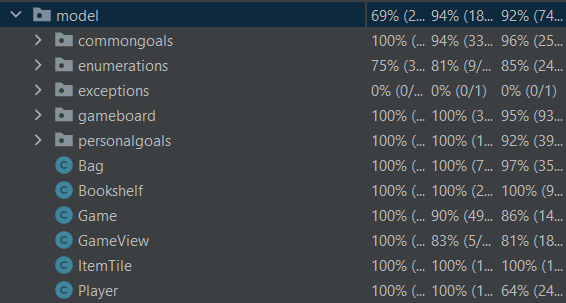

# Progetto di Ingegneria del Software 2023


## Index
- Group Components
- Introduction to "My Shelfie"
- Implemented Features
<!--- Tests-->
- User Instructions
- Troubleshooting


## Group Components

| Cognome        | Nome     |
|----------------|----------|
| Zanca          | Federico |
| Zhenghao Zhuge | Michele  |
| Wu             | Jia Hui  |
| Zheng          | Fabio    |


## Introduction to "My Shelfie"


My Shelfie is a board game that can be enjoyed by 2 to 4 players, set in a living room where every player is given a bookshelf to place item tiles picked from the living room board.
The participants compete with each other to fulfill goals that award points. These goals are visible to everyone and are randomly drawn during the game setup. Every player is also assigned a personal goal card that is not visible to others. Points are also awarded for the number of adjacent tiles you manage to place in your bookshelf.
The game ends when a player fills all the squares of their books and continues until it reaches the player sitting to the right of the first player.
The player with the most points wins.

This game is perfect for a tranquil evening with your family or friends but also promises to be competitive enough to add some zest.


## Implemented Features
Number of Advanced Features implemented: 3/4
|Feature |Status|
|--------|------------|
| Simplified Rules |  |
|Complete Rules|  |
|TUI|  |
|GUI |  |
|Socket Connection|  |
|JavaRMI Connection|  |
|Multiple Games|   |
|Resilience to Disconnections|   |
|Chat|   |
|Server Persistence|   |

<!--
## Tests




-->

## User Instructions

Into the deliverables folder of this poject can be found two jar files.

#### The "server.jar" is the executable dedicated to the server.

Execute with command:
```sh
java -jar server.jar
```
No interactions are possible with the server.

#### The "client.jar" is the executable dedicated to the clients.

Execute with command:
```sh
java -jar client.jar
```

#### Executing the client will display a message asking to choose between GUI and CLI.

Type:
- 0 to access CLI interface
- Any other character or word to access GUI interface


#### Insert the IP adress of the server you wish to connect to.

#### Choose the connection mode 

On client startup enter:
- 1 for socket connection
- 2 for RMI connection
A dialog asking you to choose which connection is preferred will be shown before trying to connect to the server.
### Troubleshooting
#### Can't connect through RMI
Some Windows devices may face difficulties connecting through JavaRMI.
To address this problem the user running the server should launch the jar this way
```sh
java -Djava.rmi.server.hostname=[IPADDRESS of the server] -jar server.jar
```
#### Proportions in the GUI are messed up
This may be due to Windows screen scaling. Setting screen scaling to 100% instead of 125% is recommended.<br>
Settings > Display > Scale Rendering
### License

This project is developed in collaboration with Politecnico di Milano and Cranio Creations.

All rights of graphic resources are reserved to Cranio Creations.

NOTA: My Shelfie è un gioco da tavolo sviluppato ed edito da Cranio Creations Srl. I contenuti grafici di questo progetto riconducibili al prodotto editoriale da tavolo sono utilizzati previa approvazione di Cranio Creations Srl a solo scopo didattico. È vietata la distribuzione, la copia o la riproduzione dei contenuti e immagini in qualsiasi forma al di fuori del progetto, così come la redistribuzione e la pubblicazione dei contenuti e immagini a fini diversi da quello sopracitato. È inoltre vietato l'utilizzo commerciale di suddetti contenuti.


